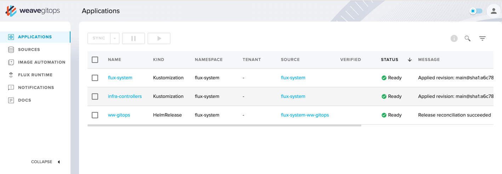
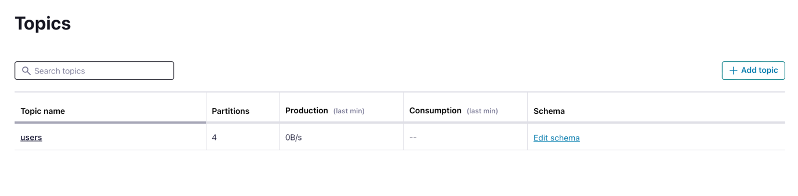
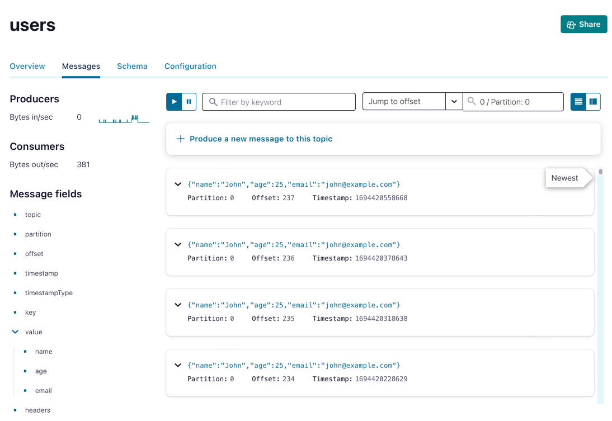

# streaming-applications-gitops

In this exercise, we're going to see how to deploy and run a Kafka streaming application on Kubernetes using the GitOps approach.

You will:
1. Create a local Kubernetes cluster.
2. Install the FluxCD GitOps tool.
3. Build and package a simple kafka producing application.
4. Deploy this application by just committing code to GitHub.

You need:
- A Confluent Cloud cluster (the Staging cluster you provisioned in the previous hands-on exercise will do)
- A GitHub account
- [Homebrew](https://brew.sh)

### Install Kind

We're going to need a Kubernetes cluster to deploy FluxCD and run our application.
If you don't already have a Kubernetes cluster to play with, you can create one with [Kind](https://kind.sigs.k8s.io).  

Once you have Homebrew installed, just run:

```shell
brew install kind
```

## Create a local Kubernetes cluster

Next up, create a cluster 
```sh
kind create cluster --name streaming-apps-gitops
```

You will also need `kubectl` so let's install it now:
```sh
brew install kubectl
```

Activate the cluster with the following command:
```sh
kubectl cluster-info --context kind-streaming-apps-gitops
```

Let's check if we can see the Kubernetes node created by Kind:
```sh
kubectl get nodes
```

Here's what you should see:
```shell
NAME                                   STATUS   ROLES           AGE   VERSION
streaming-apps-gitops-control-plane   Ready    control-plane   16m   v1.27.1
```

### Install FluxCD
Next up, let's install the [FluxCD GitOps tool](https://fluxcd.io).
```
brew install fluxcd/tap/flux
```

You will need to export your GitHub username and a classic GitHub Personal Access Token, just make sure that this token has the permissions to read/write repositories AND packages too.

```sh
export GITHUB_USER=<your github username>
export GITHUB_TOKEN=<your github personal access token>
```

Let's verify that we have all we need before going further with FluxCD:

```sh
flux check --pre
```

If you see the following, all is good!

```shell
► checking prerequisites
✔ Kubernetes 1.27.1 >=1.25.0-0
✔ prerequisites checks passed
```

Let's have flux go through the bootstrap process to create a new GitHub repository and link it to your freshly installed Kubernetes cluster. You will have to type or paste your GitHub personal access token.

```sh
flux bootstrap github \
  --owner=$GITHUB_USER \
  --repository=streaming-applications-gitops \
  --branch=main \
  --path=./clusters/staging \
  --personal
```

Once the bootstrap is done, when you list the namespaces, you should see that the `flux bootstrap` command has created a `flux-system` namespace:
```shell
kubectl get ns
```

This is what I got on my machine:
```shell 
NAME                 STATUS   AGE
default              Active   106s
flux-system          Active   24s
kube-node-lease      Active   106s
kube-public          Active   106s
kube-system          Active   106s
local-path-storage   Active   102s
```

In order to make changes to your cluster, you must first clone the `streaming-applications-gitops` GitHub repository on your machine:

```sh
git clone https://github.com/$GITHUB_USER/streaming-applications-gitops
cd streaming-applications-gitops
```

## Install the Weave GitOps Dashboard
Before we move on and create the files necessary to deploy our apps, we're going to install a nice dashboard to get us a visual interface and understand what's going on.

Install the open source Weave GitOps CLI with:
```shell
brew tap weaveworks/tap
brew install weaveworks/tap/gitops
```

Deploy the dashboard with:
```shell
mkdir -p infrastructure/controllers

PASSWORD="admin"
gitops create dashboard ww-gitops \
  --password=$PASSWORD \
  --export > infrastructure/controllers/weave-gitops-dashboard.yaml

```
Create a file `clusters/staging/infrastructure.yaml`:
```yaml
---
apiVersion: kustomize.toolkit.fluxcd.io/v1
kind: Kustomization
metadata:
  name: infra-controllers
  namespace: flux-system
spec:
  interval: 1h
  retryInterval: 1m
  timeout: 5m
  sourceRef:
    kind: GitRepository
    name: flux-system
  path: ./infrastructure/controllers
  prune: true
  wait: true
```

Commit and push
```shell
git add clusters infrastructure
git commit -m "Deploy Weave GitOps Dashboard"
git push origin main
```

Wait a few seconds for the Weave GitOps controller service to appear under the name `ww-gitops-weave-gitops`:
```shell
kubectl get services --namespace flux-system -w 
```

When the controller is up and running, in a separate terminal, forward the service port to your host machine:
```shell
kubectl port-forward svc/ww-gitops-weave-gitops -n flux-system 9001:9001
```

Point your browser to `https://localhost:9001`, the login is `admin` and the `password` is `admin` too.
This dashboard will give you a clue to visualize what's going on and troubleshoot issues.



## Install the Sealed Secret controller
Kubernetes just computes a hash for classic secrets but what we really want is to store our secrets safely in the repository.
For this purpose, we will use [Bitnami's Sealed Secrets](https://github.com/bitnami-labs/sealed-secrets) to encrypt the classic Kubernetes secrets.

The first step is to deploy the Sealed Secrets controller and install the `kubeseal` CLI tool:

```bash
brew install kubeseal
```

Then, create a Flux `Helm repository` resource that points to the sealed-secrets Helm chart:
```shell
flux create source helm sealed-secrets \
    --url https://bitnami-labs.github.io/sealed-secrets \
    --interval 1h \
    --export \
    > infrastructure/controllers/sealed-secrets-source.yaml
```

Also create a Flux `Helm release` resource:

```bash
flux create helmrelease sealed-secrets \
    --interval=1h \
    --release-name=sealed-secrets \
    --target-namespace=flux-system \
    --source=HelmRepository/sealed-secrets \
    --chart=sealed-secrets \
    --chart-version=">=1.15.0-0" \
    --crds=CreateReplace \
    --export \
    > infrastructure/controllers/sealed-secrets-release.yaml
```

Deploy the Sealed Secrets controller by pushing the files to GitHub:

```shell
git add infrastructure/
git commit -m "Deploy Bitnami Sealed Secrets"
git push origin main
```

The reconciliation process will automatically deploy the controller.

You can now retrieve and store on your disk the public key from the `sealed-secrets` controller with `kubeseal`:
```sh
kubeseal --fetch-cert \
    --controller-name=sealed-secrets \
    --controller-namespace=flux-system \
    > pub-sealed-secrets.pem
```


## Create the demo-apps namespace

Run this command to 
```shell
kubectl create namespace demo-apps
```
Make this namespace the active one:
```shell
kubectl config set-context --current --namespace=demo-apps 
```

## Create secrets to connect to Confluent Cloud

Create a dry-run normal secret in Kubernetes format into a file:
```shell
kubectl create secret generic client-credentials \
    --from-literal=bootstrap-server=YOUR_BOOTSTRAP_SERVER \
    --from-literal=cluster-api-key=YOUR_CLUSTER_API_KEY \
    --from-literal=cluster-api-secret=YOUR_CLUSTER_API_SECRET \
    --from-literal=schema-registry-url=YOUR_SCHEMA_REGISTRY_URL \
    --from-literal=schema-registry-api-key=YOUR_SCHEMA-REGISTRY-API-KEY \
    --from-literal=schema-registry-api-secret=YOUR_SCHEMA-REGISTRY-API-SECRET \
    --dry-run=client \
    -o yaml > client-credentials-secret.yaml
```

In my case, the `client-credentials-secret.yaml` file looks like this:
```shell
apiVersion: v1
data:
  bootstrap-server: WU9VUl********
  cluster-api-key: WU9VUl********
  cluster-api-secret: WU9VUl********
  schema-registry-api-key: WU9VUl********
  schema-registry-api-secret: WU9VUl********
  schema-registry-url: WU9VUl********
kind: Secret
metadata:
  creationTimestamp: null
  name: client-credentials
```

Use the `kubeseal` CLI to create a Sealed Secret, it will be attached to the currently active namespace (`demo-apps`): 

```bash
mkdir -p apps/staging 
kubeseal --format=yaml --cert=pub-sealed-secrets.pem \
    < client-credentials-secret.yaml \
    > apps/staging/client-credentials-sealed-secret.yaml
```

Let's have a look at the file:
```shell
cat apps/staging/client-credentials-sealed-secret.yaml
```

It should look like this, note that it represents a SealedSecret object.

```shell
apiVersion: bitnami.com/v1alpha1
kind: SealedSecret
metadata:
  creationTimestamp: null
  name: client-credentials
  namespace: demo-apps
spec:
  encryptedData:
    bootstrap-server: ***********************************
    cluster-api-key: ***********************************==
    cluster-api-secret: ***********************************==
    schema-registry-api-key: ***********************************
    schema-registry-api-secret: ***********************************
    schema-registry-url: ***********************************=
  template:
    metadata:
      creationTimestamp: null
      name: client-credentials
      namespace: demo-apps
```

Commit and push
```shell
git add apps/staging
git commit -m "Add confluent cloud client credentials"
git push origin main
```

You have to apply the manifest manually (for some reason Flux doesn't register it automatically):
```shell
kubectl apply -f apps/staging/client-credentials-sealed-secret.yaml
```

## Create a secret for your Helm Chart registry
Flux will need permission to access your Helm Charts registry in order to fetch the helm charts from your own private Github Container Registry. 

Create a secret for your token:
```shell
flux create secret oci ghcr-auth \
  --url=ghcr.io \
  --username=flux \
  --password=${GITHUB_TOKEN}
```

## Create a secret to access your Docker Images registry
You also need to generate a docker registry secret, so that Flux can pull docker images from your own private Github Container Registry.

This command will just do a dry-run creation of the secret and write it to a file:

```shell
kubectl create secret docker-registry docker-regcred \
--dry-run=client \
--docker-server=ghcr.io \
--docker-username=$GITHUB_USER \
--docker-password=$GITHUB_TOKEN \
--namespace=demo-apps \
-o yaml > docker-secret.yaml
```

Seal this classic Kubernetes secret with `kubeseal`:

```shell
mkdir -p apps/base/simple-streaming-app
kubeseal --format=yaml --cert=pub-sealed-secrets.pem < docker-secret.yaml > apps/base/simple-streaming-app/docker-secret-sealed-secret.yaml
```

Commit and push
```shell
git add apps/base
git commit -m "Add Docker Registry secret"
git push origin main
```

You have to apply the manifest manually (for some reason Flux doesn't register it automatically):
```shell
kubectl apply -f apps/base/simple-streaming-app/docker-secret-sealed-secret.yaml
```

## Create the files under the ./apps/base folder

Create a file `apps/base/simple-streaming-app/namespace.yaml`:
```yaml
apiVersion: v1
kind: Namespace
metadata:
  name: demo-apps
  labels:
    toolkit.fluxcd.io/tenant: demo-dev-team
```

Create a file `apps/base/simple-streaming-app/release.yaml`:
```yaml
apiVersion: helm.toolkit.fluxcd.io/v2beta1
kind: HelmRelease
metadata:
  name: simple-streaming-app
  namespace: demo-apps
spec:
  chart:
    spec:
      chart: simple-streaming-app
      reconcileStrategy: ChartVersion
      sourceRef:
        kind: HelmRepository
        name: simple-streaming-app-helm-repo
  install:
    createNamespace: true
  interval: 2m
  releaseName: simple-streaming-app-release-name
```

Create a file `apps/base/simple-streaming-app/repository.yaml`, don't forget to replace `YOUR_GIHTUB_USER` in the file with your own GitHub username:
```yaml
apiVersion: source.toolkit.fluxcd.io/v1beta2
kind: HelmRepository
metadata:
  name: simple-streaming-app-helm-repo
  namespace: demo-apps
spec:
  interval: 1m
  type: oci
  url: oci://ghcr.io/YOUR_GIHTUB_USER/charts
  secretRef:
    name: docker-regcred
```

You have to apply the manifest manually (for some reason Flux doesn't register it automatically):
```shell
kubectl apply -f apps/base/simple-streaming-app/repository.yaml
```

Finally, create a Kustomization file `apps/base/simple-streaming-app/kustomization.yaml`:
```yaml
apiVersion: kustomize.config.k8s.io/v1beta1
kind: Kustomization
namespace: demo-apps
resources:
  - namespace.yaml
  - repository.yaml
  - release.yaml
  - docker-secret-sealed-secret.yaml
```

## Create the files under the ./apps/staging folder

Create the file `apps/staging/simple-streaming-app-values.yaml`:
```yaml
apiVersion: helm.toolkit.fluxcd.io/v2beta1
kind: HelmRelease
metadata:
  name: simple-streaming-app
  namespace: demo-apps
spec:
  chart:
    spec:
      version: ">=0.1-alpha"
  test:
    enable: false
```

Finally, create the Kustomization file `apps/staging/kustomization.yaml`:
```yaml
apiVersion: kustomize.config.k8s.io/v1beta1
kind: Kustomization
resources:
  - ../base/simple-streaming-app/release.yaml
patches:
  - path: simple-streaming-app-values.yaml
    target:
      kind: HelmRelease
  - path: client-credentials-sealed-secret.yaml
    target:
      kind: SealedSecret
```

Commit and push
```shell
git add apps
git commit -m "Add apps files"
git push origin main
```

## Build, package and publish the example application

Note that in this hands-on exercise, for the sake of brevity, we're going to build and package the app manually instead of building a CI/CD pipeline.

Fork the https://github.com/gphilipp/simple-streaming-app repository under your own username and clone it on your machine.

```shell
git clone https://github.com/$GITHUB_USER/simple-streaming-app && cd simple-streaming-app 
```

In the `deploy/simple-streaming-app/values.yaml` file, replace `YOUR_GITHUB_USERNAME` with your own GitHub username.

Next, log into the GitHub Container Registry with Docker:

```shell
echo $GITHUB_TOKEN | docker login ghcr.io -u $GITHUB_USER --password-stdin
```

First, let's build the Docker image:

```shell
docker build  -t ghcr.io/$GITHUB_USER/simple-streaming-app:0.1.0 . 
docker push ghcr.io/$GITHUB_USER/simple-streaming-app:0.1.0
```
Next up, log into the Helm Registry.
```sh
echo $GITHUB_TOKEN | helm registry login ghcr.io/$GITHUB_USER --username $GITHUB_USER --password-stdin
```

You should now package up the application helm chart.  
```shell
 cd deploy 
 helm package simple-streaming-app
```
 
Finally, publish it as a package to GitHub Container Registry:
```sh
 export CHART_VERSION=$(grep 'version:' ./simple-streaming-app/Chart.yaml | tail -n1 | awk '{ print $2 }')
helm push ./simple-streaming-app-${CHART_VERSION}.tgz oci://ghcr.io/$GITHUB_USER/charts/
```

Point your browser to your own Helm Chart repository and verify that it's there:
```sh
open https://github.com/users/$GITHUB_USER/packages/container
```


## Create the users topic

Before we deploy the application, we need the topic in Confluent Cloud. 
You can either: 
  1. Create a pre-task that runs a `curl` command and use the [Confluent Cloud Topic Creation API](https://docs.confluent.io/cloud/current/api.html#tag/Topic-(v3)/operation/createKafkaTopic).
  2. Create a pre-task with the [Weave GitOps Terraform Controller](https://github.com/weaveworks/tf-controller) to reconcile a Terraform Topic resource the GitOps way

For the sake of brevity, just create the `users` topic manually in the Confluent Cloud UI console.



## Deploy the application in the Staging cluster

Create a file `clusters/staging/apps.yaml`:
```shell
apiVersion: kustomize.toolkit.fluxcd.io/v1
kind: Kustomization
metadata:
  name: apps
  namespace: flux-system
spec:
  interval: 1m0s
  sourceRef:
    kind: GitRepository
    name: flux-system
  path: ./apps/staging
  prune: true
  wait: true
  timeout: 1m0s
```

```shell
git add clusters
git commit -m "Add apps to the cluster"
git push origin main
```

Once the application deployment is reconciled, you will see that messages will be published in the `users` topic in your Confluent Cloud Cluster.



_NOTE: this exercice is loosely inspired from the [flux2-kustomize-helm-example](https://github.com/fluxcd/flux2-kustomize-helm-example) template by the Flux Community._
